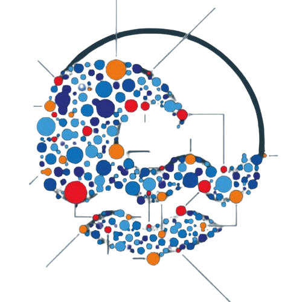
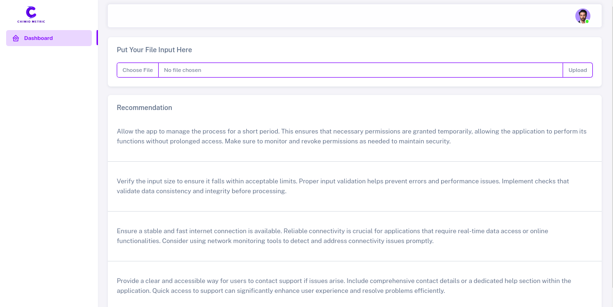
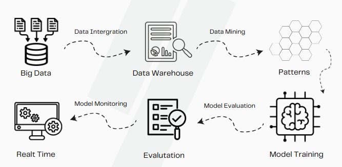
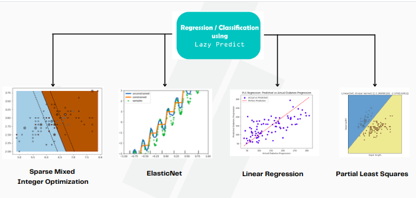

# CHEMOMETRICS WITH MACHINE LEARNING 
<a name="readme-top"></a>
[![Contributors][contributors-shield]][contributors-url]
[![Forks][forks-shield]][forks-url]
[![Stargazers][stars-shield]][stars-url]
[![Issues][issues-shield]][issues-url]
[![MIT License][license-shield]][license-url]
[![LinkedIn][linkedin-shield]][linkedin-url]

<!-- logo-->
<br />
<div align="center">
  <a href="#">
    
  </a>

  <h3 align="center">Chemometrics & Machine Learning</h3>

  <p align="center">
    A new Machine Learning approach to solve the problem of chemometrics in the field of chemistry
    <br />
    <a href="https://github.com/bouslama-hamza"><strong>Explore the docs</strong></a>
    <br />
    <br />
  </p>
</div>

<!-- ABOUT THE PROJECT -->
## About The Project
<div align="justify">
Chemometrics and machine learning have revolutionized the way we analyze chemical data, providing robust tools for interpreting complex datasets. However, one of the significant challenges in this field is the problem of short data, where the number of samples is insufficient for traditional machine learning models to perform effectively. This issue is particularly prevalent in spectroscopic analyses, where obtaining a large number of samples can be time-consuming and costly.

<br>
<div align="center">
<a href="#">
    
  </a>
</div>
<br>

The short data problem often leads to overfitting, where models perform well on training data but fail to generalize to new, unseen data. This can result in poor predictive performance and unreliable analytical results. To address this issue, we implemented a solution using wavelength selection, a technique that enhances the robustness of machine learning models by selecting the most informative wavelengths from the spectral data.

Wavelength selection helps mitigate the short data problem by reducing the dimensionality of the dataset, thereby focusing the model's learning process on the most relevant spectral features. This approach not only improves the model's performance but also enhances its interpretability. By identifying and using only the essential wavelengths, we can avoid the noise and redundancy that often accompany full-spectrum data.
</div>


<p align="right">(<a href="#readme-top">back to top</a>)</p>

## Project Context
<div align="center">
<a href="#">
    
  </a>
</div>
<br>
<div align="justify">
Our solution involves a systematic process of evaluating different wavelength selection methods, such as genetic algorithms, interval partial least squares (iPLS), and successive projections algorithm (SPA).Following the KDD process, we first preprocess the data by normalizing the spectral data and splitting it into training and test sets. We then apply the wavelength selection methods to identify the most informative wavelengths for each model.
</div>

## Project Architecture

<a href="#">
    
  </a>
</div>
<br>

<div align="justify">
To make our approach more proefficient, we implemented deffirent machine learning models using LazyPredict library which end up with chosing SMIO , Linear Regression , Glmnet , and PLSregression to predict the concentration of the chemical compound.
</div>

## Built In Technologie
There are numerous technologies employed in this project's final product, taking into account design, back-end, front-end, and more, but we may concentrate on the most crucial one as the following.

* [![Django][Django.com]][Django-url]
* [![Bootstrap][Bootstrap.com]][Bootstrap-url]
* [![JQuery][JQuery.com]][JQuery-url]

<p align="right">(<a href="#readme-top">back to top</a>)</p>


<!-- GETTING STARTED -->
## Getting Started

_The project's concept may seem a little sophisticated, but the steps for getting started are quite simpler. We may summarize them as follows.._

1. Make sure that connection is really istablished
2. Clone the repo
   ```
   git clone https://github.com/bouslama-hamza/CHEMOMETRICS.git
   ```

3. Go To the Real Time Web App Directory
   ```
   cd Real Time Web App/
   ```

4. Install Django packages
   ```
   pip install -r requirement.txt
   ```
   
5. Make Migrations to launch the data base
   ```
    python manage.py makemigration
   ``` 
   ```
    python manage.py migrate
   ```

6. Run the server
   ```
    python manage.py runserver
    ```

<p align="right">(<a href="#readme-top">back to top</a>)</p>


<!-- CONTRIBUTING -->
## Contributing

Contributions are what make the open source community such an amazing place to learn, inspire, and create. Any contributions you make are **greatly appreciated**.

<p align="right">(<a href="#readme-top">back to top</a>)</p>


<!-- CONTACT -->
## Contact

Hamza Bouslama - [Gmail Account](ham.bousa98@gmail.com)

Project Link: [https://github.com/bouslama-hamza/WEB-3.0](https://github.com/bouslama-hamza/CHEMOMETRICS.git)

<p align="right">(<a href="#readme-top">back to top</a>)</p>

<!-- MARKDOWN LINKS & IMAGES -->
<!-- https://www.markdownguide.org/basic-syntax/#reference-style-links -->
[contributors-shield]: https://img.shields.io/github/contributors/othneildrew/Best-README-Template.svg?style=for-the-badge
[contributors-url]: https://github.com/othneildrew/Best-README-Template/graphs/contributors
[forks-shield]: https://img.shields.io/github/forks/othneildrew/Best-README-Template.svg?style=for-the-badge
[forks-url]: https://github.com/othneildrew/Best-README-Template/network/members
[stars-shield]: https://img.shields.io/github/stars/othneildrew/Best-README-Template.svg?style=for-the-badge
[stars-url]: https://github.com/othneildrew/Best-README-Template/stargazers
[issues-shield]: https://img.shields.io/github/issues/othneildrew/Best-README-Template.svg?style=for-the-badge
[issues-url]: https://github.com/othneildrew/Best-README-Template/issues
[license-shield]: https://img.shields.io/github/license/othneildrew/Best-README-Template.svg?style=for-the-badge
[license-url]: https://github.com/othneildrew/Best-README-Template/blob/master/LICENSE.txt
[linkedin-shield]: https://img.shields.io/badge/-LinkedIn-black.svg?style=for-the-badge&logo=linkedin&colorB=555
[linkedin-url]: https://linkedin.com/in/hamza-bouslama
[Django.com]:https://img.shields.io/badge/Django-0769AD?style=for-the-badge&logo=django&logoColor=white
[Django-url]:https://www.djangoproject.com/
[Bootstrap.com]: https://img.shields.io/badge/Bootstrap-563D7C?style=for-the-badge&logo=bootstrap&logoColor=white
[Bootstrap-url]: https://getbootstrap.com
[JQuery.com]: https://img.shields.io/badge/jQuery-0769AD?style=for-the-badge&logo=jquery&logoColor=white
[JQuery-url]: https://jquery.com 